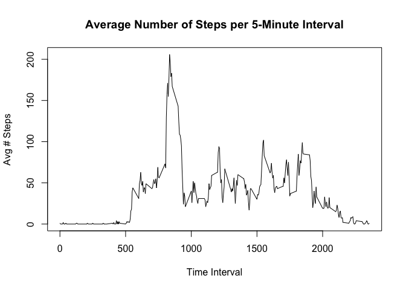
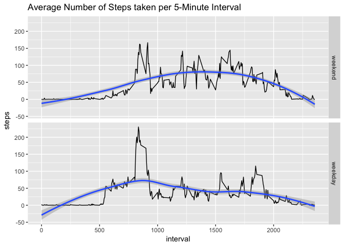

# Reproducible Research Project 1: Fitbit Data Analysis
Robert Smith  
12/21/2016  

## Loading and preprocessing the data
The data for the Fitbit analysis in this document is the "activity.zip" file in this repository. Alternatively, the file can be downloaded from https://d396qusza40orc.cloudfront.net/repdata%2Fdata%2Factivity.zip. 


```r
raw<-read.csv(unzip("activity.zip"),na.strings="NA")
#When running str(raw), date column is a factor. Re-cast as a Date:
raw$date<-as.Date(raw$date)
```

## What is mean total number of steps taken per day?


```r
#Use aggregate function to sum steps by date
daily_summary<-aggregate(steps~date,data=raw,sum)
#Make histogram of steps taken each day
hist(daily_summary$steps,breaks=20,col="light blue",xlab="Total Steps",main="Histogram of Total Daily Steps")
```

<!-- -->

```r
#Find mean and median total number of steps taken per day. Cast mean as integer for unit consistency.
avg_total_daily_steps<-as.integer(mean(daily_summary$steps))
median_total_daily_steps<-median(daily_summary$steps)
```
The average total daily steps is 10766.  
The median total daily steps is 10765.  

## What is the average daily activity pattern?


```r
library(dplyr);library(xtable)
#Use na.rm=TRUE to exclude empty intervals for the mean. Cast mean as an integer for unit consistency
dailyprofile<-group_by(raw,interval)%>%summarize(mean=as.integer(mean(steps,na.rm=TRUE)))

#Plot average daily walking profile
plot(dailyprofile$interval,dailyprofile$mean,type='l',ylab="Avg # Steps",xlab="Time Interval",main="Average Number of Steps per 5-Minute Interval")
```

<!-- -->

```r
#Find max 5-minute interval
xtab<-xtable(dailyprofile[order(dailyprofile$mean,decreasing=TRUE)[1],])
print(xtab,type="html")
```

<!-- html table generated in R 3.3.2 by xtable 1.8-2 package -->
<!-- Wed Dec 21 19:45:20 2016 -->
<table border=1>
<tr> <th>  </th> <th> interval </th> <th> mean </th>  </tr>
  <tr> <td align="right"> 1 </td> <td align="right"> 835 </td> <td align="right"> 206 </td> </tr>
   </table>
This individual is very active between 5-10 am. 

## Impute missing values

```r
#Calculate total number of missing values for "steps" in dataset
total_missing_values<-sum(is.na(raw$steps))

#Use average steps by interval profile to replace missing values
missing_data<-filter(raw,is.na(steps))
imputed_data<-merge(dailyprofile,missing_data,by="interval")%>%select(interval,mean,date)
colnames(imputed_data)[2]<-"steps"

#Create new dataset with imputed values
clean_df<-rbind(imputed_data,filter(raw,!is.na(steps)))
summary(clean_df)
```

```
##     interval          steps             date           
##  Min.   :   0.0   Min.   :  0.00   Min.   :2012-10-01  
##  1st Qu.: 588.8   1st Qu.:  0.00   1st Qu.:2012-10-16  
##  Median :1177.5   Median :  0.00   Median :2012-10-31  
##  Mean   :1177.5   Mean   : 37.33   Mean   :2012-10-31  
##  3rd Qu.:1766.2   3rd Qu.: 27.00   3rd Qu.:2012-11-15  
##  Max.   :2355.0   Max.   :806.00   Max.   :2012-11-30
```

```r
#Historgram of total number of steps taken each day
daily_summary_clean<-aggregate(steps~date,data=clean_df,sum)
hist(daily_summary_clean$steps,breaks=20,col="light blue",xlab="Total Steps",main="Histogram of Total Daily Steps with Imputed Vaues")
```

<!-- -->

```r
#Find mean and median total number of steps taken per day. Cast as integer for unit consistency
avg_total_daily_steps_clean<-as.integer(mean(daily_summary_clean$steps))
median_total_daily_steps_clean<-median(daily_summary_clean$steps)
```
Total Number of Missing Step Values: 2304  
The average total daily steps is 10749.  
The median total daily steps is 10641.  

Calculating the mean and median total daily steps on the imputed data indicates a lower mean and median value compared to the original data set. This is due to a lower total step count in each of the days that were fully imputed (e.g. every interval was updated).

## Are there differences in activity patterns between weekdays and weekends?

```r
#Add Week/Weekend Column
clean_df<-mutate(clean_df,DayofWeek=as.factor(weekdays(date)))
weekend<-filter(clean_df,DayofWeek=="Saturday"|DayofWeek=="Sunday")%>%mutate(WeekFactor=as.factor("weekend"))
week<-filter(clean_df,DayofWeek!="Saturday",DayofWeek!="Sunday")%>%mutate(WeekFactor=as.factor("weekday"))
week_df<-rbind(weekend,week)

#Calculate Average 5-minute weekday and weekend walking profiles
plot_data<-select(week_df,interval,steps,WeekFactor)%>%group_by(interval,WeekFactor)%>%summarise(steps=mean(steps))

#Plot Profiles - use ggplot
library(ggplot2)
ggplot(plot_data,aes(interval,steps))+geom_line()+facet_grid(WeekFactor~.)+ggtitle("Average Number of Steps taken per 5-Minute Interval")+geom_smooth(method="loess")
```



There is a distinct difference between weekend and weekday walking profiles. Weekdays have a 'spike' in the pace of steps in the morning, followed by a low level of activity for the remainder of the day. Weekend days have a less pronounced morning 'spike' in activity, followed by sustained moderate level activity until the late evening hours.`
